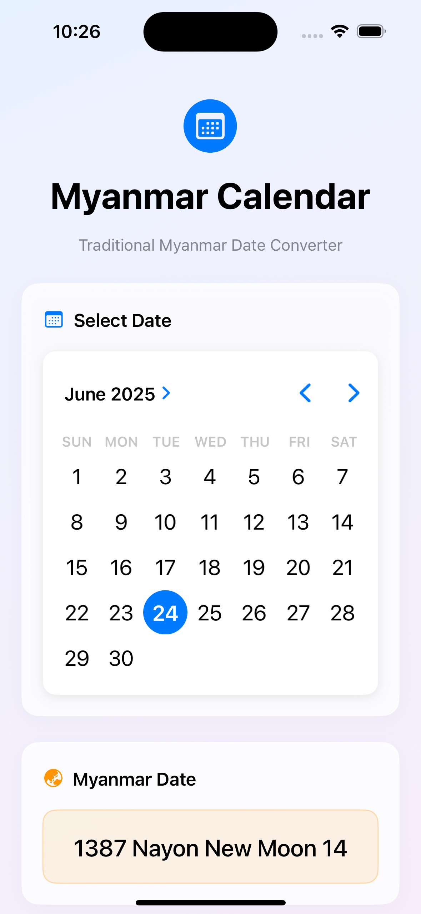
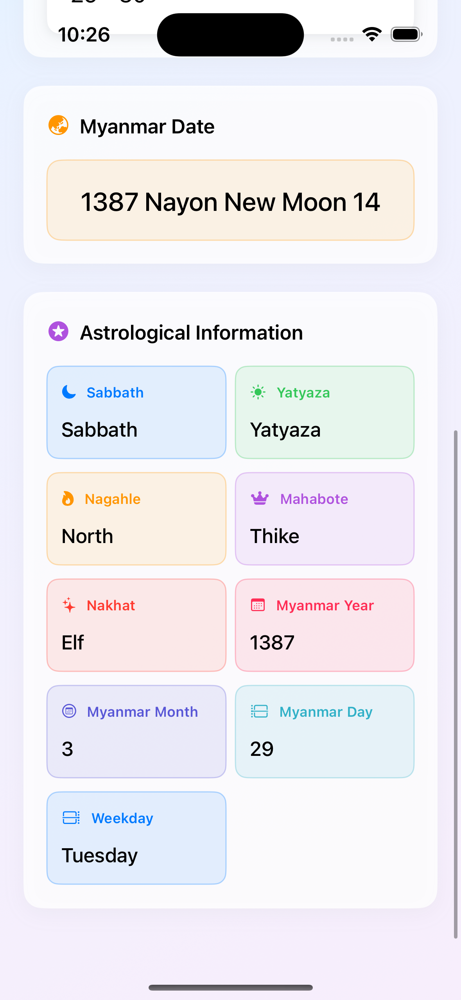
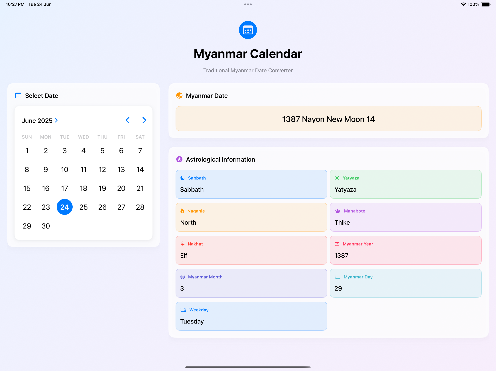
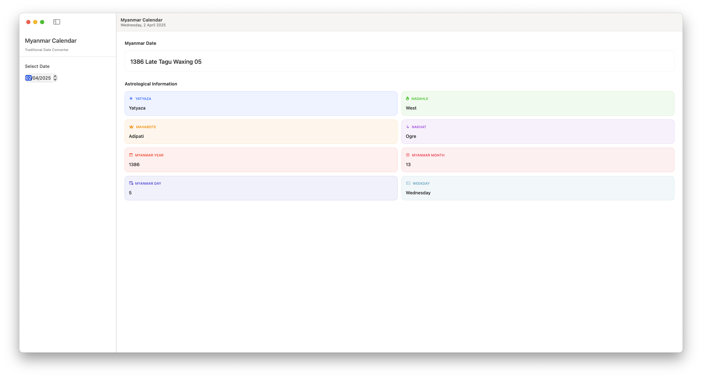

# MMCal Swift

Using `ceMmDateTime_Swift.js` from [mmcal](https://github.com/yan9a/mmcal). 

To use in your project copied

- MyanmarCalendar.swift
- ceMmDateTime_Swift.js

## Example

```swift
// Usage example
class MyanmarCalendarExample {
    func demonstrateUsage() {
        do {
            // Current date
            print("=== CURRENT DATE ===")
            let calendar = try MyanmarCalendar()
            
            print("Myanmar Date String: \(calendar.getCurrentMyanmarDateString() ?? "N/A")")
            print("Pyathada: \(calendar.pyathada ?? "N/A")")
            print("Myanmar Year: \(calendar.myanmarYear ?? 0)")
            print("Myanmar Month: \(calendar.myanmarMonth ?? 0)")
            print("Myanmar Day: \(calendar.myanmarDay ?? 0)")
            print("Sabbath: \(calendar.sabbath ?? "N/A")")
            print("Yatyaza: \(calendar.yatyaza ?? "N/A")")
            print("Nagahle: \(calendar.nagahle ?? "N/A")")
            print("Mahabote: \(calendar.mahabote ?? "N/A")")
            print("Nakhat: \(calendar.nakhat ?? "N/A")")
            
            // Custom date - equivalent to JavaScript:
            // var julianDate = ceDateTime.w2j(2025, 6, 24, 12, 0, 0);
            // var customMdt = new ceMmDateTime(julianDate);
            print("\n=== CUSTOM DATE: June 24, 2025 ===")
            
            // Method 1: Using Julian date (most similar to JavaScript)
            let julianDate = try MyanmarCalendar.westernToJulian(year: 2025, month: 6, day: 24, hour: 12, minute: 0, second: 0)
            let customCalendar1 = try MyanmarCalendar(julianDate: julianDate)
            
            print("Julian Date: \(julianDate)")
            print("Myanmar Date String: \(customCalendar1.getCurrentMyanmarDateString() ?? "N/A")")
            print("Pyathada: \(customCalendar1.pyathada ?? "N/A")")
            print("Weekday: \(customCalendar1.weekday ?? 0) [0=Sat, 1=Sun, 2=Mon, 3=Tue, 4=Wed, 5=Thu, 6=Fri]")
            print("Sabbath: \(customCalendar1.sabbath ?? "N/A")")
            print("Yatyaza: \(customCalendar1.yatyaza ?? "N/A")")
            print("Nagahle: \(customCalendar1.nagahle ?? "N/A")")
            print("Mahabote: \(customCalendar1.mahabote ?? "N/A")")
            print("Nakhat: \(customCalendar1.nakhat ?? "N/A")")
            
            // Method 2: Direct convenience initializer
            print("\n=== USING CONVENIENCE INITIALIZER ===")
            let customCalendar2 = try MyanmarCalendar(year: 2025, month: 6, day: 24, hour: 12, minute: 0, second: 0)
            print("Myanmar Date String: \(customCalendar2.getCurrentMyanmarDateString() ?? "N/A")")
            
        } catch {
            print("Error initializing Myanmar Calendar: \(error)")
        }
    }
}
```

## Screenshots

### iPhone





### iPad 



### Mac

